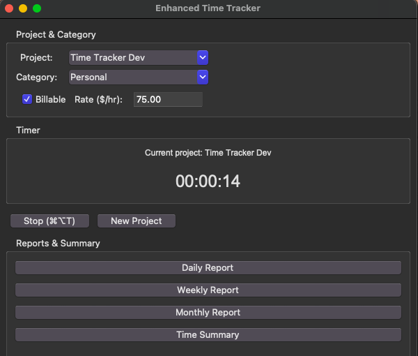
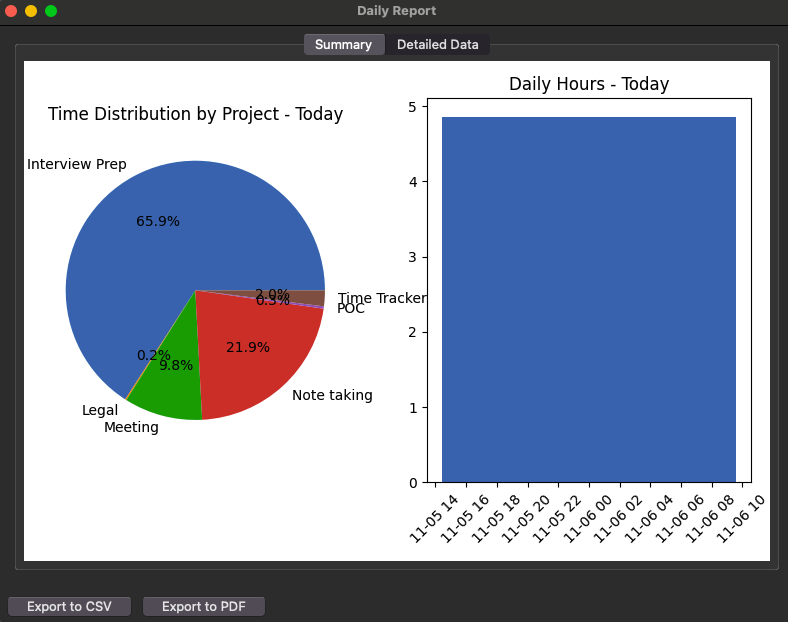
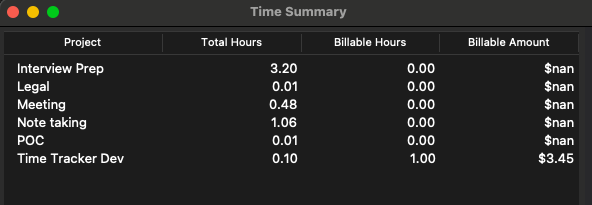

# Time Tracker

A desktop application for tracking time spent on different projects, with support for billable hours and detailed reporting.

Currently tested with macOS only so far. 

## Features

- Track time with keyboard shortcuts (⌘⌥T for start/stop)
- Project and category organization
- Billable hours tracking with customizable rates
- Automatic idle detection
- Task reminders at customizable intervals
- Detailed reports (daily, weekly, monthly)
- Export data to CSV and PDF
- Visual analytics with charts

## Installation

1. Clone the repository:
```bash
git clone https://github.com/sethbarr/time_tracker.git
cd time_tracker
chmod +x time_tracker.py
```

2. Create and activate a virtual environment (recommended):
```bash
# On macOS/Linux
python3 -m venv venv
source venv/bin/activate

# On Windows
python -m venv venv
.\venv\Scripts\activate
```

3. Install dependencies:
```bash
pip install -r requirements.txt
```

## Usage

1. Launch the application:
```bash
python time_tracker.py
```

2. Basic Operations:
   - Select or create a project
   - Set billable status and rate (if applicable)
   - Use keyboard shortcut ⌘⌥T (Command-Option-T) or click button to start/stop timer
   - Monitor time in the timer display



You can also produce reports and export data to CSV or PDF.

(I think the barchart isn't working quite yet.)

And produce a billable hours report.


3. Features:
   - **Project Management**: Create and select projects from the dropdown
   - **Categories**: Organize time entries with categories
   - **Billable Hours**: Mark time as billable and set hourly rates
   - **Idle Detection**: Automatically pauses when no activity is detected
   - **Task Reminders**: Get periodic reminders to verify current task
   - **Reports**: Generate daily, weekly, or monthly reports
   - **Time Summary**: View total time and billable amounts per project

4. Reports and Export:
   - Use the Reports section to generate time summaries
   - Export data to CSV for spreadsheet analysis
   - Generate PDF reports for client billing

## Settings

- **Idle Threshold**: Set how long to wait before marking as idle (default: 5 minutes)
- **Reminder Interval**: Set how often to show task reminders (default: 30 minutes)
- **Billable Rates**: Set per-project billing rates

## Data Storage

- Time entries are stored locally in `~/.timetracker/`
- Automatic backups are created hourly

## Known Issues

- Some keyboard shortcuts may require additional permissions on macOS
- PDF export requires reportlab package

## Contributing

Contributions are welcome! Please feel free to submit a Pull Request.

## License

This project is licensed under the Apache 2 License - see the LICENSE file for details.